<p align="right"><a href="README.md">中文</a> · <strong>English</strong></p>

# Primuse

A native iOS / macOS / Apple TV music player that streams from NAS, media servers, cloud drives and local network sources, with metadata scraping, lyrics display, cross-device sync and external playback control.

> 🎉 **Now on the App Store** — search for "Primuse" on the China App Store to download it for free.

<p align="center">
  <a href="https://apps.apple.com/us/app/%E7%8C%BF%E9%9F%B3/id6761675450">
    
  </a>
</p>

## Screenshots

<p align="center">
  
  
  
  
</p>
<p align="center">
  
  
  
</p>

## macOS Desktop App

A native desktop client redesigned for the Mac, sharing the same music library, data sources and iCloud sync with iOS.

<table>
  <tr>
    <td align="center">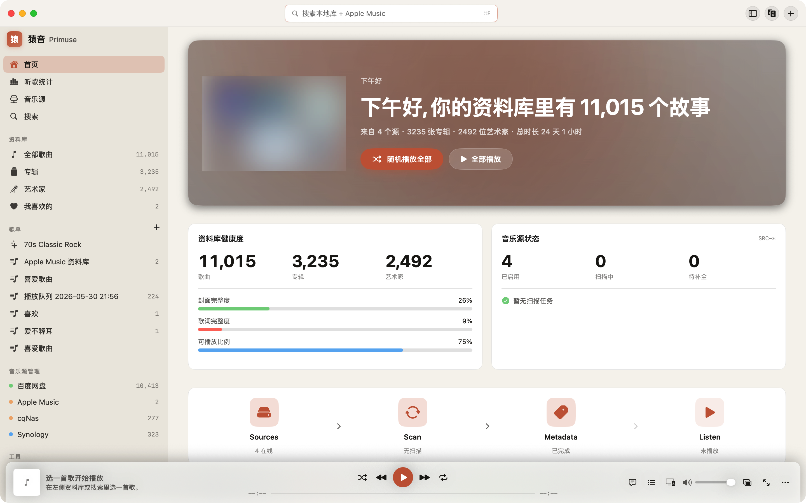<br/>Home</td>
    <td align="center">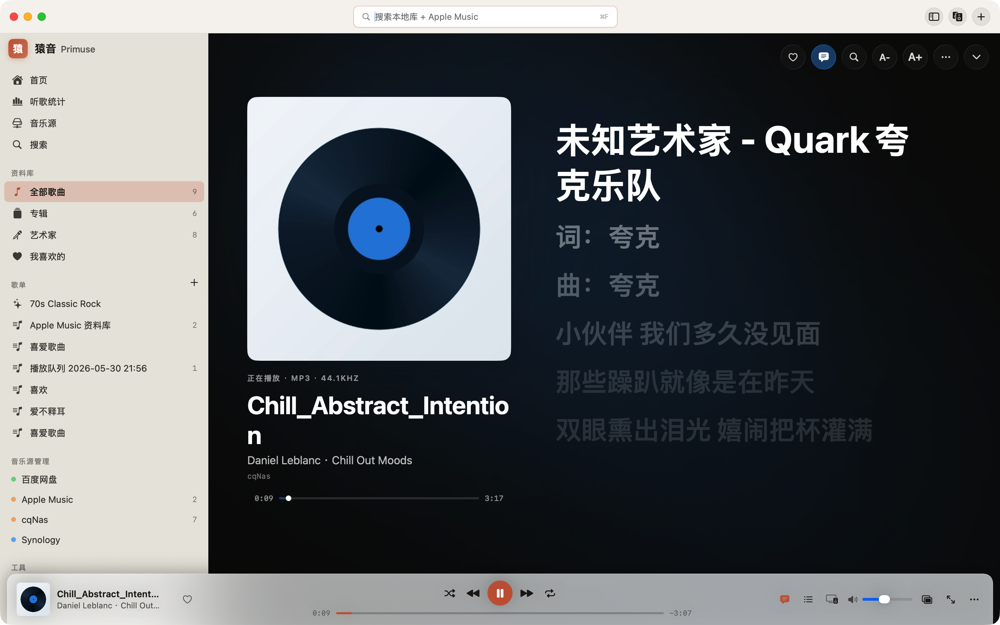<br/>Player</td>
  </tr>
  <tr>
    <td align="center">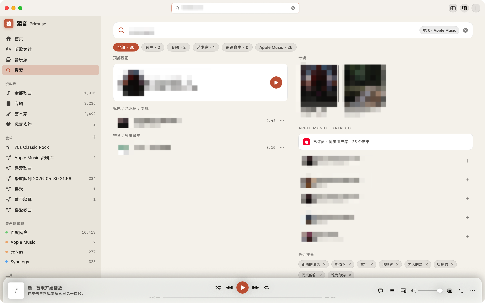<br/>Search</td>
    <td align="center">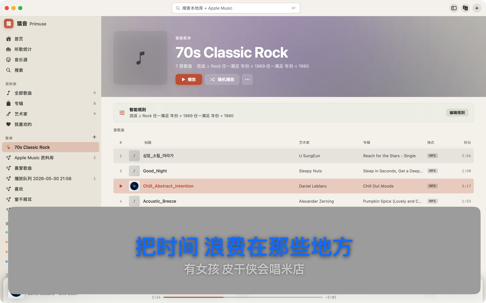<br/>Desktop Lyrics</td>
  </tr>
  <tr>
    <td align="center">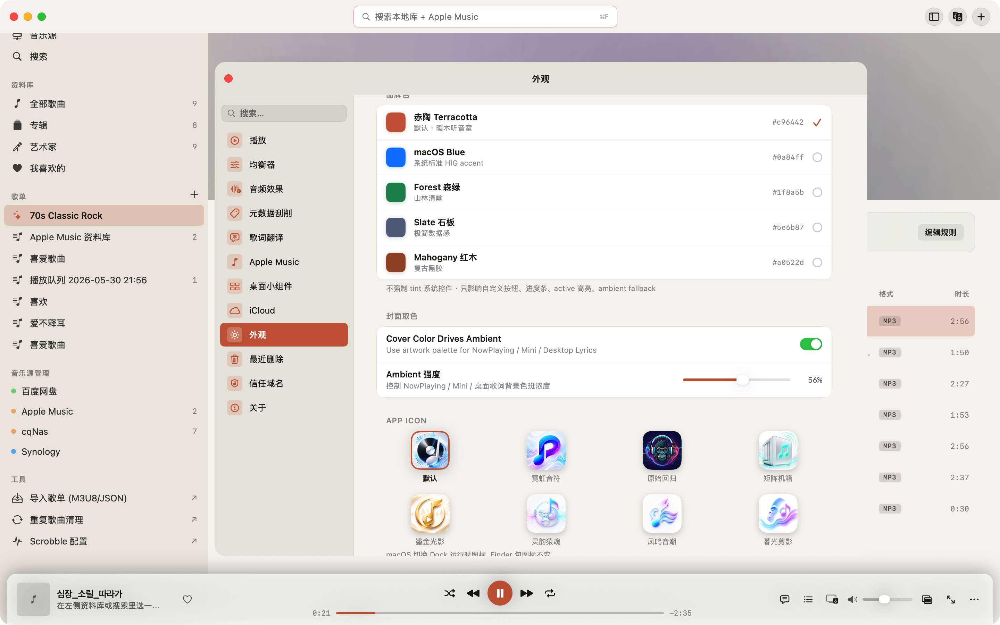<br/>Appearance</td>
    <td align="center">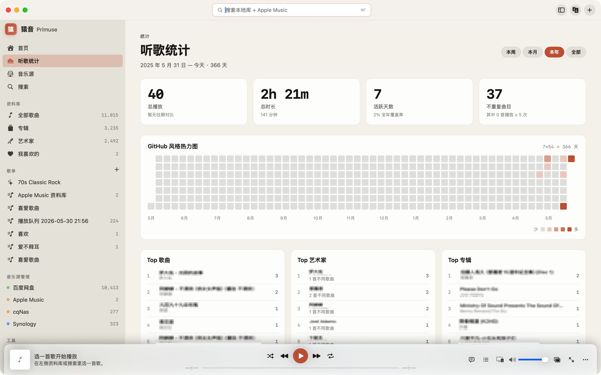<br/>Listening Stats</td>
  </tr>
  <tr>
    <td align="center">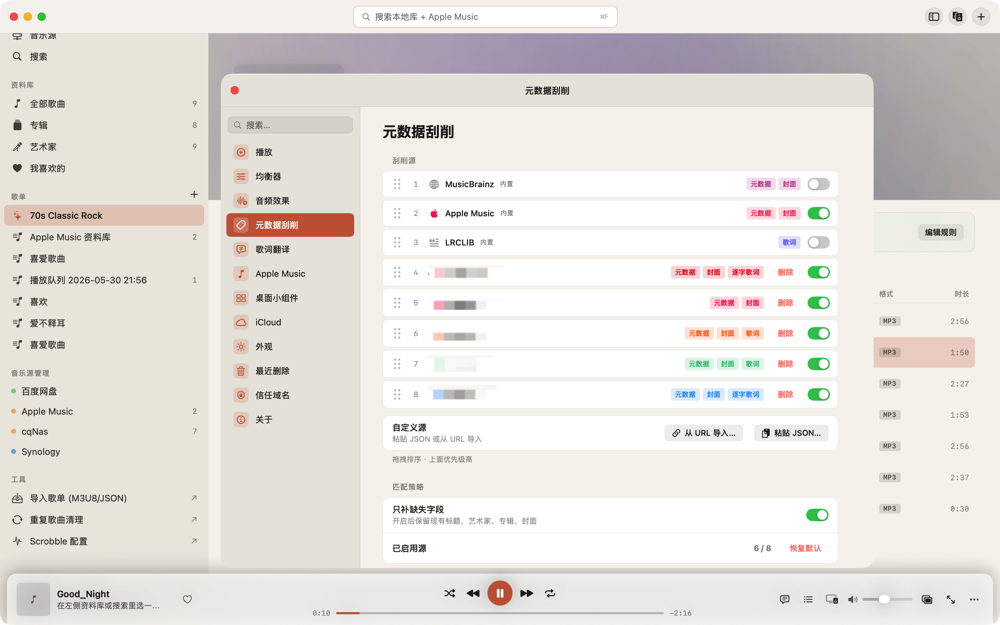<br/>Metadata Scraping</td>
    <td align="center">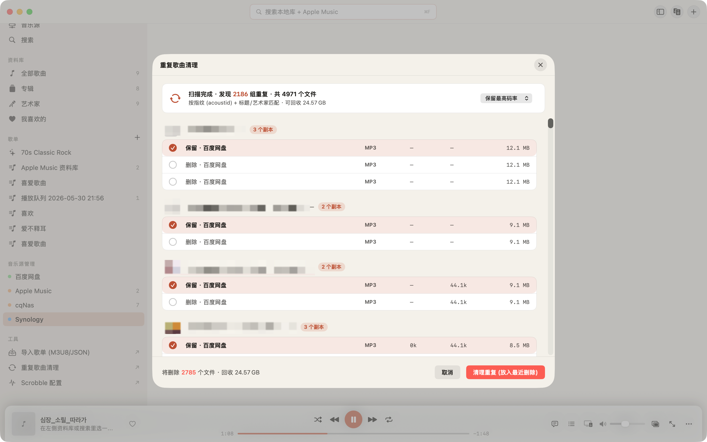<br/>Duplicate Cleanup</td>
  </tr>
  <tr>
    <td align="center">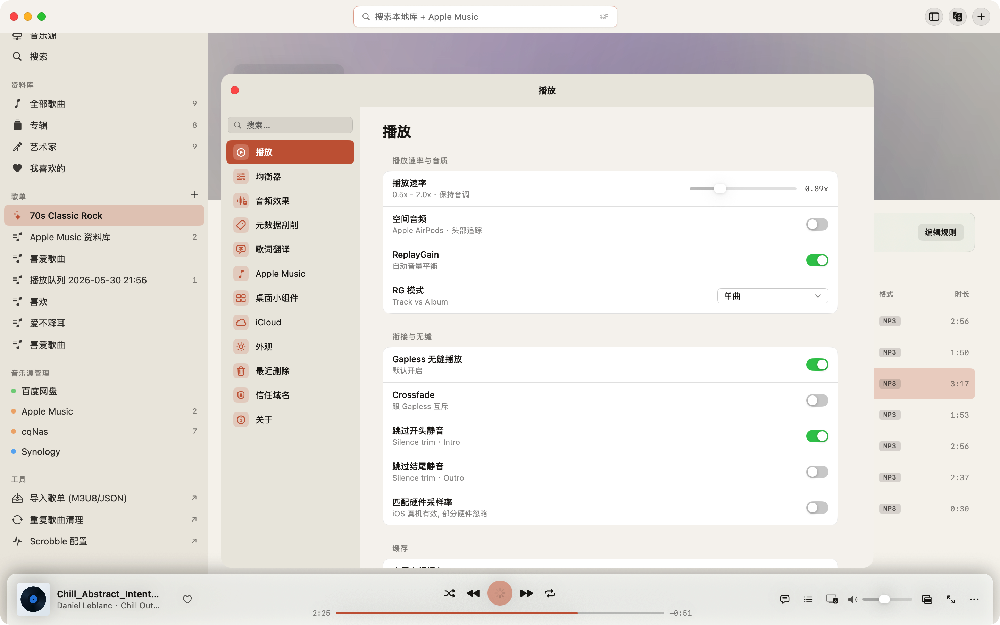<br/>Settings</td>
    <td align="center">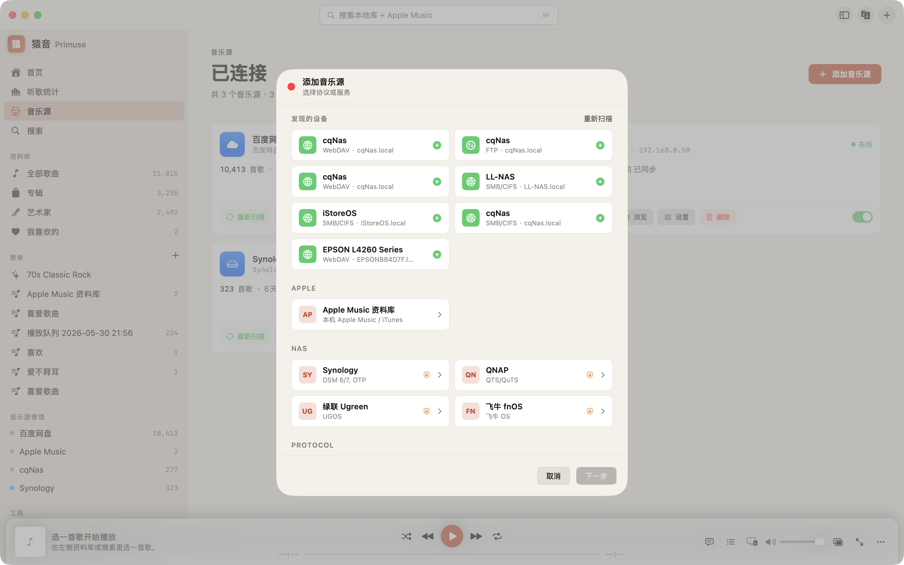<br/>Add Music Source</td>
  </tr>
</table>

### macOS-Specific Features

- **Native desktop UI** — custom title bar, collapsible sidebar and bottom playback control bar, designed for large screens and mouse/trackpad input
- **Mini player** — collapses into a floating panel (NSPanel) with a lyrics page and a playback queue page
- **Menu bar player** — a status-bar popover for quick playback control
- **Desktop lyrics** — a standalone floating lyrics window supporting two-line / single-line / vertical layouts and a click-through lock
- **Appearance customization** — themes, brand color and app icon switching, dynamic color extraction from album art, light / dark mode
- **Desktop widgets** — WidgetKit widgets such as Now Playing and Quick Access, with all sizes previewable in settings
- **DLNA casting** — discover speakers / TVs on the local network and push playback to them (CAST panel)
- **System media keys / shortcuts** — Mac keyboard media keys and customizable playback shortcuts
- **Audio output selection** — switch between multiple output devices
- **Full library tooling** — smart playlist editor, duplicate cleanup, tag editor, playlist import and a standalone metadata scraping window
- **Multi-display playback** — large cover art and large-font lyrics on an external display

All other capabilities — multi-source streaming, audio-quality processing, metadata scraping, cross-device sync, etc. — match iOS; see the feature list below.

## Apple TV App

Play your whole collection on the big screen in the living room, sharing the same music library, data sources and iCloud sync with iPhone / Mac.

<table>
  <tr>
    <td align="center">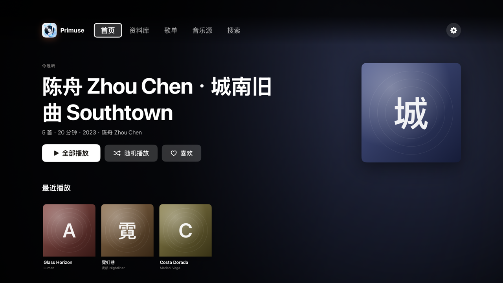<br/>Home</td>
    <td align="center">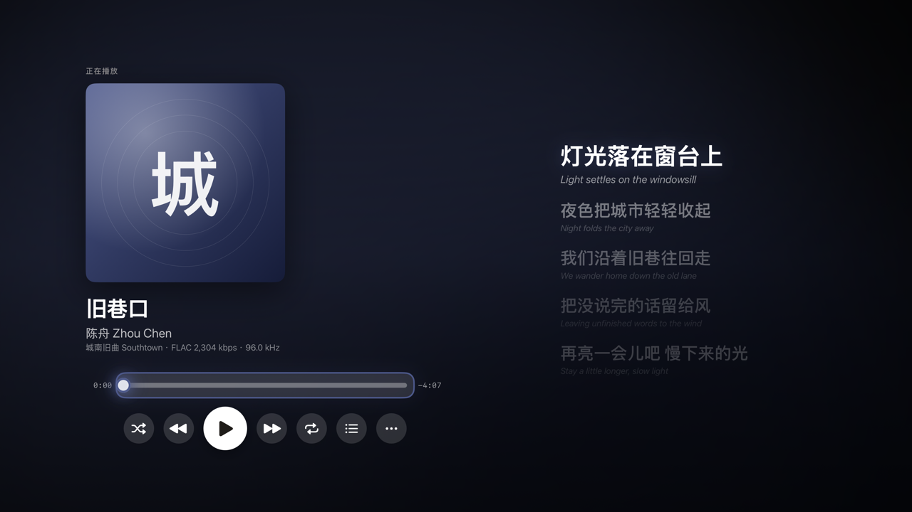<br/>Now Playing</td>
  </tr>
  <tr>
    <td align="center">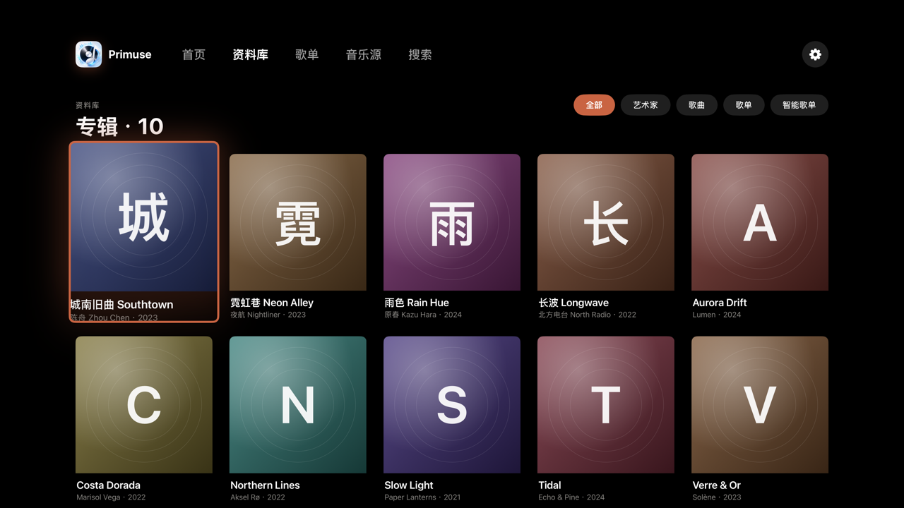<br/>Library</td>
    <td align="center">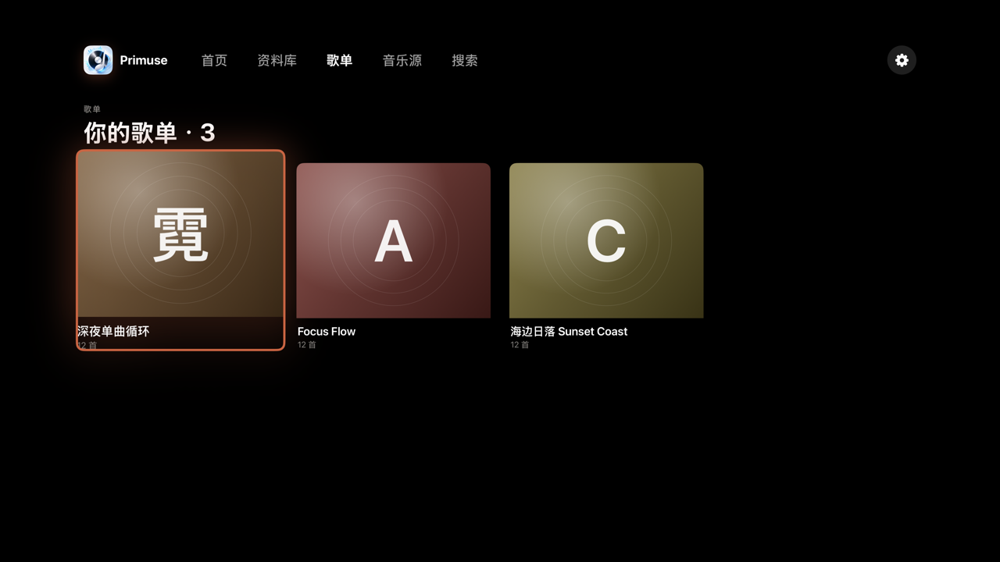<br/>Playlists</td>
  </tr>
  <tr>
    <td align="center">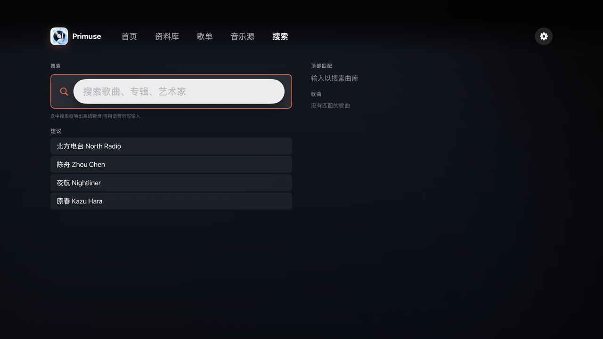<br/>Search</td>
    <td></td>
  </tr>
</table>

### Apple TV-Specific Features

- **Whole-library browsing on the big screen** — albums / artists / playlists / songs at a glance, smooth Siri Remote control, one-tap Play All / Shuffle All across the entire library
- **Word-by-word lyrics** — full-screen scrolling karaoke-style lyrics with original text + translation and current-line highlighting
- **Top Shelf** — shows recently played and recommendations when the app is focused on the Home screen
- **Direct multi-source access** — NAS, self-hosted servers (Navidrome / Subsonic, etc.) and cloud drives play directly on the TV; some sources are relayed through the iPhone
- **Multi-device sync** — library, playlists, data sources sync in real time with iPhone / Mac over iCloud
- **English & Chinese UI** — switches automatically with the system language

All other capabilities — multi-source streaming, audio-quality processing, cross-device sync, etc. — match iOS.

## Features

- **Multi-source streaming** — supports Synology DSM, QNAP, UGREEN UGOS, Feiniu fnOS, SMB/CIFS, WebDAV, SFTP, FTP, NFS, S3, UPnP/DLNA, Jellyfin, Emby, Plex and local files
- **Cloud drive access** — supports Baidu Netdisk, Aliyun Drive, Google Drive, OneDrive and Dropbox; cloud tracks can play while downloading and cache on demand
- **Playback engine** — built on SFBAudioEngine, supporting FLAC, APE, WAV, MP3, AAC, Opus, DSD, TTA, WV and more, with crossfade, ReplayGain, sleep timer, EQ, reverb and compression/limiting
- **DLNA receiver** — acts as a UPnP/AV MediaRenderer on the same Wi-Fi network, so control points such as VLC, Synology Audio Station, Plex and Hi-Fi Cast can discover it and cast audio to it
- **Apple Music search** — once authorized, search the Apple Music catalog alongside your library and play subscription content through the system player
- **Metadata scraping** — built-in iTunes, MusicBrainz and LRCLIB sources, with support for importing custom scraping sources via JSON config
- **Configurable scraping sources** — import third-party metadata, cover and lyrics sources by pasting a JSON config or a URL
- **Sidecar write-back** — scraped covers (`-cover.jpg`) and lyrics (`.lrc`) are written back to the NAS automatically
- **Lyrics experience** — LRC / word-level lyrics, desktop-lyrics-style display on an external screen, lyrics translation caching and manual scraping correction
- **Library management** — album/artist grouping, regular playlists, smart playlists, M3U8/JSON playlist import & export, duplicate detection and Recently Deleted
- **Sync & stats** — iCloud CloudKit sync for sources, playlists, playback history and settings, plus listening stats, a yearly report and Last.fm / ListenBrainz scrobbling
- **System integration** — Live Activities, Dynamic Island, Lock Screen controls, Home Screen widgets, Control Widgets, Apple Watch, CarPlay, Siri / Shortcuts, Spotlight search, AirPlay and external displays

## Requirements

- **Xcode 16.0+**
- **Swift 6.0+**
- **iOS 18.0+** deployment target, **watchOS 10.0+** Watch target
- A macOS build environment (Apple Silicon recommended)

## Getting Started

### 1. Clone the repository

```bash
git clone git@github.com:chenqi92/primuse.git
cd primuse
```

### 2. Open the project

```bash
open Primuse.xcodeproj
```

On first open, Xcode resolves the Swift Package Manager dependencies automatically, which may take a few minutes.

### 3. Configure signing

1. Open `Primuse.xcodeproj` in Xcode
2. Select the **Primuse** project in the project navigator
3. For each target (**Primuse**, **PrimuseKit**, **PrimuseWidgetExtension**, **PrimuseActivityExtension**):
   - Go to **Signing & Capabilities**
   - Change **Team** to your Apple Developer account
   - Xcode generates the provisioning profiles automatically
4. To use the DLNA receiver on a physical device, enable the **Multicast Networking** capability for your App ID in the Apple Developer portal and make sure the provisioning profile includes `com.apple.developer.networking.multicast`

You can also edit `DEVELOPMENT_TEAM` in `project.yml` and regenerate the project.

### 4. Configure local secrets (optional)

Copy `Config/Secrets.local.xcconfig.example` to `Config/Secrets.local.xcconfig` and fill in cloud-drive OAuth or a default Last.fm API key as needed. This file is git-ignored; when left empty, Last.fm asks the user to paste their own key in Settings.

### 5. Build & run

Pick a target device/simulator and press `Cmd+R`, or use the command line:

```bash
# Simulator build
xcodebuild -scheme Primuse \
  -destination 'platform=iOS Simulator,name=iPhone 17 Pro' \
  build

# Device build (requires signing)
xcodebuild -scheme Primuse \
  -destination 'id=YOUR_DEVICE_UDID' \
  build
```

### 6. Install to a device from the command line

```bash
# Install
xcrun devicectl device install app \
  --device YOUR_DEVICE_UDID \
  ~/Library/Developer/Xcode/DerivedData/Primuse-*/Build/Products/Debug-iphoneos/Primuse.app

# Launch
xcrun devicectl device process launch \
  --device YOUR_DEVICE_UDID \
  com.welape.yuanyin
```

## Custom Scraping Sources

Primuse can import custom metadata scraping sources via JSON config. Each config file describes the API endpoint, request format and a JavaScript parsing script.

### Config format

```json
{
  "id": "my-source",
  "name": "My Music Source",
  "version": 1,
  "icon": "music.note",
  "color": "#FF6600",
  "rateLimit": 500,
  "headers": {
    "User-Agent": "Mozilla/5.0"
  },
  "capabilities": ["metadata", "cover", "lyrics"],
  "sslTrustDomains": ["example.com"],
  "search": {
    "url": "https://api.example.com/search",
    "method": "GET",
    "params": { "q": "{{query}}", "limit": "{{limit}}" },
    "script": "var items = response.results || []; return items.map(function(s) { return {id: String(s.id), title: s.name, artist: s.artist, album: s.album, durationMs: s.duration, coverUrl: s.cover}; });"
  },
  "detail": { "url": "...", "method": "GET", "script": "..." },
  "cover": { "url": "...", "method": "GET", "script": "..." },
  "lyrics": { "url": "...", "method": "GET", "script": "..." }
}
```

### How to import

1. Open **Settings → Metadata Scraping → Import Scraping Source**
2. Choose **Paste Config** or **Import from URL**
3. The imported source appears in the scraping-source list, where it can be reordered by dragging and enabled/disabled

### JS script reference

- `response`: the parsed JSON response object
- `responseText`: the raw response text
- `externalId`: the external ID of the current song (available in the detail/cover/lyrics endpoints)
- `log(msg)`: debug log output

**search script** returns `[{id, title, artist, album, durationMs, coverUrl}]`

**detail script** returns `{title, artist, album, year, coverUrl, trackNumber, genres}`

**lyrics script** returns `{lrcContent}` or `{plainText}`

**cover script** returns `[{coverUrl, thumbnailUrl}]`

## Project Structure

```
primuse/
├── Primuse/                        # Main app target
│   ├── App/                        # App entry point, ContentView
│   ├── Services/
│   │   ├── Audio/                  # Playback engine, decoders, equalizer
│   │   ├── Cloud/                  # iCloud / CloudKit sync
│   │   ├── DLNA/                   # UPnP/AV Renderer receiver & casting
│   │   ├── Library/                # Music library, database
│   │   ├── Metadata/               # Scrapers, asset storage, Sidecar writing
│   │   │   └── Scrapers/           # Configurable scraper, MusicBrainz, LRCLIB
│   │   ├── Playlist/               # Playlist import & export
│   │   ├── Scrobble/               # Last.fm / ListenBrainz
│   │   ├── Sources/                # NAS, protocol, media server & cloud connectors
│   │   └── Stats/                  # Listening stats & yearly report
│   ├── Views/
│   │   ├── Home/                   # Home (dashboard)
│   │   ├── Library/                # Album, artist, song, playlist views
│   │   ├── NowPlaying/             # Player, queue, scraping options
│   │   ├── Search/                 # Search view
│   │   ├── Settings/               # Settings, equalizer, scraper config
│   │   ├── Sources/                # Source management, connection flow
│   │   └── Components/             # Reusable UI components
│   ├── Resources/                  # Localizations (en, zh-Hans, zh-Hant, de, fr, ja, ko), assets
│   └── Utilities/                  # Logging utilities, extensions
├── PrimuseKit/                     # Shared framework (models, protocols)
│   └── Sources/PrimuseKit/Models/  # Song, Album, Artist, Playlist, etc.
├── PrimuseWidgetExtension/         # Home Screen widgets
├── PrimuseActivityExtension/       # Dynamic Island / Live Activities
├── PrimuseWatch/                   # Apple Watch app
├── PrimuseWatchWidgets/            # Watch complications
├── Config/                         # Entitlements, Info.plist config
└── project.yml                     # XcodeGen project definition
```

## Dependencies

| Package | Purpose |
|---------|---------|
| [SFBAudioEngine](https://github.com/sbooth/SFBAudioEngine) | Audio decoding (FLAC, APE, WV, TTA, DSD, MP3, AAC, etc.) |
| [GRDB.swift](https://github.com/groue/GRDB.swift) | SQLite database, music library persistence |
| [AMSMB2](https://github.com/amosavian/AMSMB2) | SMB/CIFS client, NAS access |
| [FileProvider](https://github.com/amosavian/FileProvider) | FTP/WebDAV file operations |
| [Citadel](https://github.com/orlandos-nl/Citadel) | SSH/SFTP client |
| [NFSKit](https://github.com/alexiscn/NFSKit) | NFS client |
| [swift-crypto](https://github.com/apple/swift-crypto) | Cryptographic operations |
| [swift-nio](https://github.com/apple/swift-nio) | Asynchronous networking infrastructure |

It also uses the system frameworks MusicKit, CloudKit, ActivityKit, WidgetKit, WatchConnectivity, CarPlay, MediaPlayer and Network.framework.

## Architecture

### Audio pipeline

```
Source (local / NAS / media server / cloud drive)
  → CloudPlaybackSource / StreamingDownloadDecoder / NativeAudioDecoder
  → SFBAudioEngine AudioDecoder
  → AVAudioConverter (sample rate / format conversion)
  → AVAudioEngine (PlayerNode → Mixer → EQ → Compressor → Reverb → output)
```

### Metadata scraping

```
User triggers a scrape
  → ScraperManager (tries enabled sources in priority order)
  → ConfigurableScraper (JSON config + JavaScriptCore parsing)
  → cover + lyrics + metadata
  → SidecarWriteService → NAS (<song>-cover.jpg, <song>.lrc)
  → MetadataAssetStore → local cache
```

### CI/CD

The project is set up with GitHub Actions for automated builds:

- **build**: every push/PR triggers a simulator build for verification (no signing required)
- **archive**: only when the version number changes on the `main` branch, an unsigned IPA is built automatically and uploaded as an artifact
